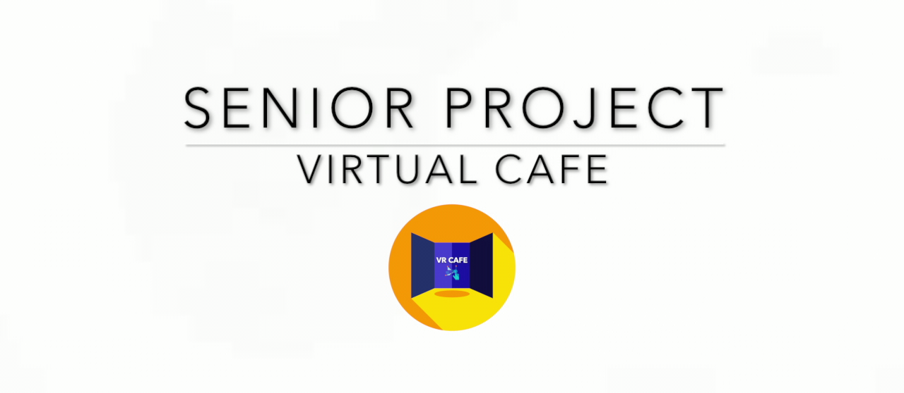

# Virtual Cafe

This application is a part of Senior Project I (CS3200) that created by Assumption University students.

Link to [Slide](Docs/slide.pdf), [Demo](https://youtu.be/NjW_Qm63NFU)

# Description

Augmented reality application that turn the surrounding environments into the virtual world using Google Tango device

# Contributors

- Chatchawan yoojuie
- Pathompong Kunapermsiri
- Natthakul Boonmee
